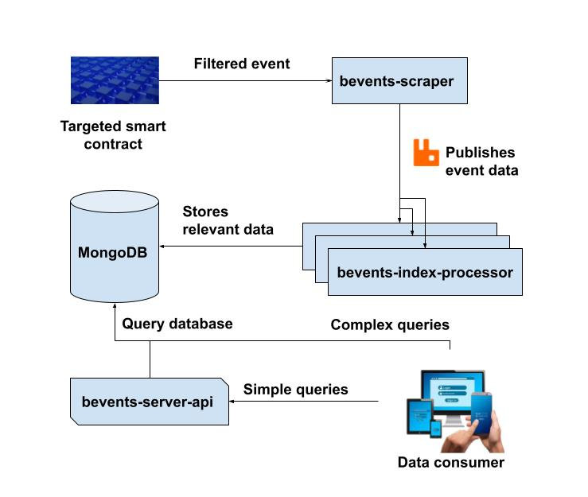

# blockchain-event-processor

## General description

_blockchain-event-processor_ is designed as a system that indexes events for a given contract. 
The indexed data is then retrievable via a web API for normal use cases. 
If more complex queries are required, the data consumer will have the option, under certain conditions, to directly query the database.

## System structure

The project will be split into the following components:

- [bevents-scraper](https://github.com/abarbatei/bevents-scraper) - component will handle reading events from a specific smart contract and passing them along to whoever is listening
- [bevents-index-processor](https://github.com/abarbatei/bevents-index-processor) - receives the events and saves plus indexes them into a persistence mechanism for later use
- [bevents-server-api](https://github.com/abarbatei/bevents-server-api) - a webserver API for general use

Communication between components is done via RabbitMQ queues. 
Data persistence is obtained using a MongoDB database.

The following diagram indicates how system components interact between each other.

## Setup

TODO
